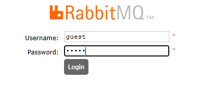

# Estudo sobre RabbitMQ

## O que é RabbitMQ ?


 RabbitMQ é um sistema de mensageria open-source que implementa o padrão AMQP (Advanced Message Queuing Protocol). 
 
Ele permite que aplicações se comuniquem entre si de forma assíncrona e desacoplada, trocando mensagens por meio 
de filas e exchanges, em vez de chamadas diretas entre sistemas.

 

Em outras palavras, ele funciona como um correio interno entre sistemas:

- Um producer (produtor) envia mensagens para uma exchange.
- A exchange direciona essas mensagens para uma ou mais filas, usando regras chamadas de bindings e routing keys.
- Um consumer (consumidor) lê as mensagens dessas filas no seu próprio ritmo.

# Principais vantagens do RabbitMQ:
- 
- Desacoplamento entre sistemas.
- Escalabilidade, permitindo múltiplos consumidores e produtores.
- Persistência das mensagens para garantir confiabilidade.
- Flexibilidade de roteamento de mensagens (direct, fanout, topic, headers).

## Vantagens do RabbitMQ
- Desacoplamento: produtores e consumidores não precisam saber nada sobre a implementação um do outro.
- Confiabilidade: mensagens podem ser persistidas em disco, garantindo entrega mesmo em caso de falhas.
- Flexibilidade de roteamento: exchanges do tipo direct, fanout, topic e headers permitem cenários complexos de 
  distribuição de mensagens.
- Suporte a múltiplos protocolos: além de AMQP, suporta MQTT, STOMP, HTTP, entre outros.
- Escalável: suporta múltiplos consumidores e balanceamento de carga. 
- Confirmations e acknowledgements: você sabe se a mensagem foi recebida com sucesso pelo consumidor.

## Desvantagens do RabbitMQ

- Latência maior que comunicação direta: é um middleware, então há overhead no envio e recebimento de mensagens.
- Complexidade: exige configuração de exchanges, bindings, filas e políticas de persistência.
- Gerenciamento de memória: filas muito grandes podem consumir muita RAM, exigindo cuidado com limites e TTL.
- Não é ideal para streaming massivo em tempo real: sistemas como Kafka podem ser mais eficientes para grandes volumes de dados contínuos.
- Operação e manutenção: requer monitoramento, backup de filas persistentes e tuning para desempenho.
 

# Dependência no projeto
 

Para que nossa aplicaçao tenha acesso ao RabbitMQ, devemos adicionar essa lib no pom.xml

```xml

<dependency>
  <groupId>org.springframework.boot</groupId>
  <artifactId>spring-boot-starter-amqp</artifactId>
</dependency>
 ```

# O que precisamos para rodar o RabbitMQ

Na aplicação já possui um docker compose  do Rabbit, apenas de o seguinte comando no terminal, garanta que esse comando 
 seja no mesmo local onde seu arquivo docker-compose.yml esteja nele:

```
 docker compose up
```

depois vá para localhost:15672

   

 no campo username e password digite guest e clique no login

depois voltamos e damos uma olhada na interface do rabbitmq olhando para o painel dele e destrinchamos ele.


# Como fazer a configuração inicial para utilizar o RabbitMQ

Antes de começar de fato utilizar a mensageria que o RabbitMQ nos proporcionar, precisamos fazer algumas configurações
para poder utilizar ele, entretanto existem 4 tipos de exchanges :
- #### DIRECT
- #### TOPIC
- #### FANOUT
- ##### HEADERS

que são consideradas estrategias de roteamento, para isso precisamos entender o que são queues, exchanges e rounting keys.
Vou explicar por cima o que cada uma faz e depois vamos ver isso no código.

## Explicando o que é um PRODUCER

O producer é responsável por enviar a mensagem para a exchange.
Para isso, ele geralmente envia três parâmetros:

1º — Qual EXCHANGE será utilizada.
2º — Qual a ROUTING KEY, que funciona como o “endereço” usado pela exchange para decidir o roteamento.
3º — A mensagem que será encaminhada para uma ou mais filas (QUEUES).

## Explicando o que é uma EXCHANGE

Uma exchange é uma estratégia de roteamento.
Ela recebe a mensagem do producer e, com base na routing key e no tipo da exchange, decide para qual fila (ou filas) a mensagem deve ir.
A exchange não armazena mensagens, ela apenas roteia.

## Explicando o que é uma QUEUE

Uma queue (fila) é o local onde as mensagens ficam armazenadas até que um consumidor as processe.
Ela garante persistência e entrega confiável, dependendo da configuração.

## Explicando o que é uma ROUTING KEY

A routing key é o “endereço de roteamento” usado pela exchange para decidir como a mensagem será entregue às filas.
Ela faz parte da ligação entre exchange ↔ fila, definindo como a mensagem chegará ao consumer.

## Explicando o que é um CONSUMER

O consumer é responsável por receber a mensagem que está na fila e processá-la — realizando validações, cálculos, integrações, gravações, etc.
Ele consome a mensagem de acordo com a lógica da aplicação.

Sabendo dessas informações vamos entender o cenario  de cada uma e entender como elas funcionam,desde a configuração 
da mensagens e produzindo e recebendo as mensagens (PRODUCER e CONSUMER)
 
Mão na massa !


Vamos mostrar passo a passo de como configurar uma exchange com suas respectivas exchanges e particularidades.

# EXCHANGE DIRECT

Classes envolvidas:

```
    RabbitConfig.java
    RabbitMQAutoDeclareConfig.java
    RabbitMQConstants.java
    PedidoController.java
    PedidoProducer.java
    PedidoConsumer.java
    PedidoService.java
```


Crie uma classe de configuração para podermos implementar nossa exchange

```java
@Configuration
public class RabbitConfig {

    @Bean
    public RabbitAdmin rabbitAdmin(ConnectionFactory connectionFactory) {
        RabbitAdmin admin = new RabbitAdmin(connectionFactory);
        admin.setAutoStartup(true);
        return admin;
    }
    /**
     * Configurando direct exchange  */
    
    // Para declararmos uma QUEUE fazemos dessa forma
    @Bean
    public Queue queue(){
        return QueueBuilder.durable(QUEUE_PEDIDOS).build();
    }
    
    //Para declararmos uma exchange do tipo Direct fazemos dessa forma
    @Bean
    public DirectExchange directExchange(){
        return ExchangeBuilder.directExchange(EXCHANGE_PEDIDOS)
                .durable(true)
                .build();
    }
    // Neste momento fazemos o binding da fila(QUEUE) para a exchange com o endereco (ROUTING_KEY)
    @Bean
    public Binding binding(){
        return BindingBuilder
                .bind(queue())
                .to(directExchange())
                .with(ROUTING_KEY_PEDIDOS);
    }
}
```

Essas constantes estão em  RabbitMQConstants.java
```java
// Por padrão, usamos o nome da exchange seguido da estratégia de roteamento,
// que neste caso é "direct".
public static final String EXCHANGE_PEDIDOS = "pedidos.direct";

// Aqui definimos o nome da fila e, por convenção, terminamos com ".queue"
// para indicar que se trata de uma fila.
public static final String QUEUE_PEDIDOS = "pedido.criado.queue";

// Aqui definimos a routing key, que é o endereço utilizado pela exchange
// para decidir qual fila receberá a mensagem.
public static final String ROUTING_KEY_PEDIDOS = "pedido.criado";

```
Vamos para o producer e neste momento vamos ver com a Exchange Direct funciona:

```java
@Service
@RequiredArgsConstructor
public class PedidoProducer {
    private static final Logger logger = LoggerFactory.getLogger(PedidoService.class);


    private final RabbitTemplate rabbitTemplate;

    public void enviarPedido(String mensagem) {
        try {
            logger.info("Enviando mensagem para a exchange '{}' com routing key '{}'",
                    EXCHANGE_PEDIDOS, ROUTING_KEY_PEDIDOS);
            //enviando mensagem para a fila 
            rabbitTemplate.convertAndSend(EXCHANGE_PEDIDOS, ROUTING_KEY_PEDIDOS, mensagem);

            logger.info("Mensagem enviada com sucesso: {}", mensagem);
        } catch (Exception e) {
            logger.error("Erro ao enviar mensagem", e);
            throw new RuntimeException("Falha ao enviar mensagem", e);
        }
    }
}

```
 e vamos pega essa mensagem no outro lado pelo Consumer:

```java
@Component
public class PedidoConsumer {
    @RabbitListener(queues = QUEUE_PEDIDOS)
    public void receberMensagem(String mensagem){
        System.out.println("mensagem recebida: " + mensagem);

    }
}

```

# 🐈‍⬛ Qual é o pulo do gato de uma EXCHANGE DIRECT?

Quando configuramos uma exchange do tipo direct, estamos dizendo que a mensagem deve ser entregue somente para a fila cujo binding utiliza exatamente a mesma routing key enviada pelo producer.
Ou seja, somente um consumer ligado a uma fila com a routing key correspondente receberá aquela mensagem.

Se a routing key não for idêntica, a mensagem não será roteada para aquele consumer.
Ela jamais cairá em uma fila que não esteja corretamente configurada.

Esse comportamento muda quando falamos da EXCHANGE TOPIC, onde podemos usar curingas (* e #) para ampliar o alcance do roteamento.

Rode o projeto e veja como funciona.
 